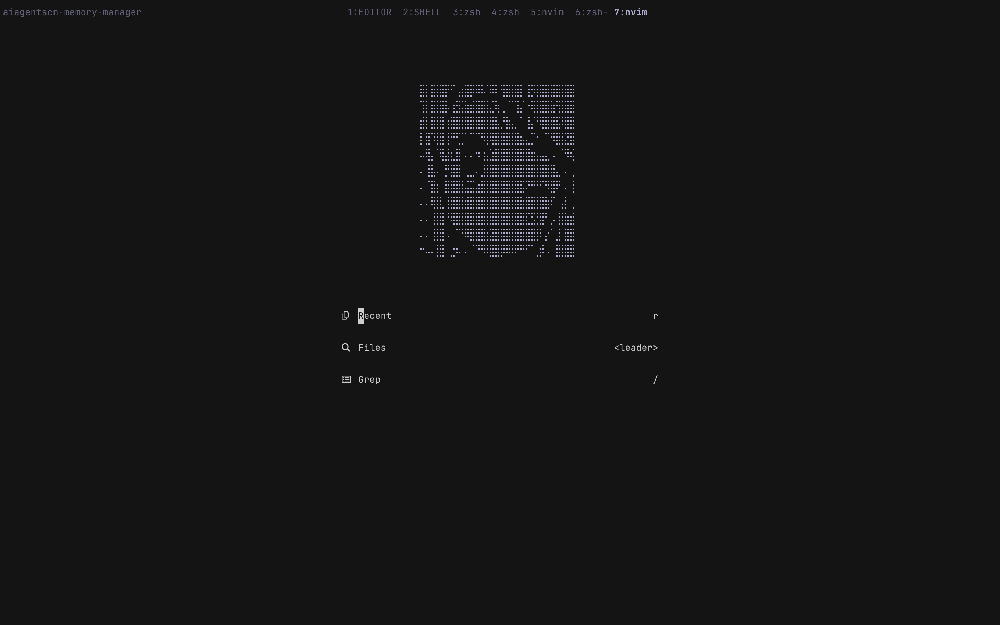

# dotfiles

**OS:** macOS Sonoma 14.6

## Useful nvim keybindnings:

- gd -- go definition (normal)

- gr -- go reference (normal)

- gc -- comment lines (visual)

- <space><space> -- fzf (telescope / find file through file system. normal)

- <space> / -- fzf (find pattern through file system. normal)
